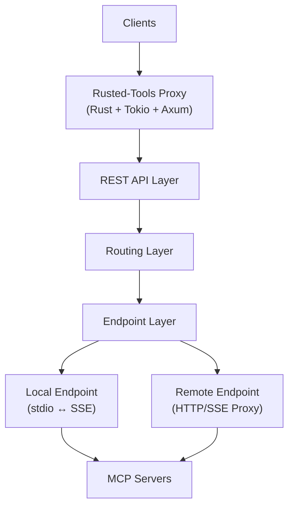

# 🦀 Rusted-Tools MCP Proxy

A high-performance Model Context Protocol (MCP) proxy server written in Rust that provides unified access to multiple MCP servers (both local and remote) through a REST API.

---

## Table of Contents

- [About](#about)
- [Getting Started](#getting-started)
- [How to Use](#how-to-use)
- [Architecture](#architecture)

---

## About

Rusted-Tools is an MCP proxy server that lets you manage multiple Model Context Protocol servers through a single REST API. It supports both local servers (Node.js, Docker, stdio-based) and remote HTTP/SSE endpoints with transparent forwarding.

### Key Features

- 🚀 **Multi-Server Management** - Run multiple MCP servers simultaneously
- 🔧 **Local & Remote Support** - stdio-based and HTTP/SSE endpoints
- 🌐 **REST API** - Simple HTTP interface for tool discovery and execution
- 🛡️ **Tool Filtering** - Allowlist/blocklist for local servers
- ⚡ **High Performance** - Built with Rust, Tokio, and Axum
- 🔀 **Transparent Proxy** - Forward remote servers without protocol translation

### Status

**Production Ready:**

- ✅ Local MCP server management (stdio-based)
- ✅ Remote MCP server support (HTTP/SSE reverse proxy)
- ✅ Native MCP HTTP/SSE protocol for local endpoints
- ✅ Tool discovery and execution via REST API
- ✅ Docker and Node.js server support

**In Progress:**

- ⚠️ Authentication
- ⚠️ Metrics collection

---

## Getting Started

### Prerequisites

- Rust 1.92+ ([rustup.rs](https://rustup.rs))
- Docker (optional, for Docker-based servers)
- Node.js (optional, for Node.js servers)

### Installation

```bash
git clone https://github.com/YOUR_USERNAME/rusted-tools
cd rusted-tools
cargo build --release
```

Binary location: `./target/release/rusted-tools`

### Quick Start

Create **config.toml**:

```toml
[http]
host = "127.0.0.1"
port = 3000

# Local MCP server
[[endpoints]]
name = "memory"
type = "local"
command = "npx"
args = ["-y", "@modelcontextprotocol/server-memory"]
auto_start = true

# Remote MCP server
[[endpoints]]
name = "remote-api"
type = "remote"
url = "https://learn.microsoft.com/api/mcp"
```

Start the proxy:

```bash
./target/release/rusted-tools --config config.toml
```

Test it:

```bash
# List servers
curl http://localhost:3000/servers | jq .

# List tools
curl http://localhost:3000/mcp/memory/tools | jq .

# Call a tool
curl -X POST http://localhost:3000/mcp/memory/tools/call \
  -H "Content-Type: application/json" \
  -d '{"name":"create_entities","arguments":{"entities":[{"name":"Test","entityType":"Demo","observations":["Hello"]}]}}' | jq .
```

---

## How to Use

### REST API Endpoints

**Management:**

| Method | Endpoint | Description |
|--------|----------|-------------|
| GET | `/health` | Health check |
| GET | `/info` | Server metadata |
| GET | `/servers` | List all configured servers |
| GET | `/servers/{name}/status` | Get status for a server |
| POST | `/servers/{name}/start` | Start a server |
| POST | `/servers/{name}/stop` | Stop a server |
| POST | `/servers/{name}/restart` | Restart a server |

**MCP Tools:**

| Method | Endpoint | Description |
|--------|----------|-------------|
| GET | `/mcp/{path}/tools` | List available tools |
| POST | `/mcp/{path}/tools/call` | Execute a tool |

### Configuration

**Server Settings:**

```toml
[http]
host = "127.0.0.1"
port = 3000

[logging]
level = "info"        # trace, debug, info, warn, error
format = "pretty"     # pretty or json

[mcp]
request_timeout_secs = 30
restart_delay_ms = 500
```

**Local MCP Server:**

```toml
[[endpoints]]
name = "my-server"
type = "local"
command = "npx"
args = ["-y", "@modelcontextprotocol/server-memory"]
auto_start = true

# Optional tool filtering
[endpoints.tools]
include = ["create_*", "read_*"]
exclude = ["dangerous_*"]
```

**Remote MCP Server:**

```toml
[[endpoints]]
name = "remote-api"
type = "remote"
url = "https://api.example.com/mcp"
```

**Docker-Based Server:**

```toml
[[endpoints]]
name = "fetch"
type = "local"
command = "docker"
args = ["run", "--rm", "-i", "mcp/fetch"]
```

See [`config.toml.example`](config.toml.example) and [`examples/`](examples/) for more configuration examples.

### CLI Options

```bash
rusted-tools --config <path> [OPTIONS]

Options:
  --config <PATH>           Configuration file path (required)
  --log-level <LEVEL>       Log level: trace, debug, info, warn, error
  --log-format <FORMAT>     Output format: pretty or json
```

### Client Integration

The proxy supports multiple integration methods:

1. **Native MCP HTTP/SSE Protocol** - Connect directly to `/mcp/{endpoint_name}` (e.g., http://localhost:3000/mcp/memory)
   - Works with LM Studio, VS Code, and any MCP client supporting HTTP/SSE
   - Full native MCP protocol support for local endpoints
   
2. **REST API** - Call `/mcp/{endpoint_name}/tools` endpoints for JSON-based tool interaction
   - Better for scripts, extensions, and custom integrations

3. **Server Management** - Start/stop endpoints via `/servers/{name}/start` and `/servers/{name}/stop`

---

## Architecture

### Overview



### Key Components

| Component | Purpose |
|-----------|---------|
| **EndpointManager** | Lifecycle management (start, stop, restart) for all servers |
| **PathRouter** | Maps request paths to endpoints using lock-free DashMap |
| **Local Endpoint** | Spawns subprocess, bridges stdio ↔ HTTP/SSE, filters tools |
| **Remote Endpoint** | Reverse proxy for HTTP/SSE - transparently forwards requests |
| **MCP Client** | Wraps rmcp SDK for protocol communication |
| **Tool Filter** | Include/exclude patterns for local server tools |

### Concurrency

- **DashMap** for lock-free concurrent collections (endpoint registry, path routing)
- **Arc<RwLock<>>** for shared resource access
- **Tokio** async runtime for all I/O operations
- **CancellationToken** for graceful shutdown

### Technology Stack

- **rmcp** - MCP SDK (protocol, transports)
- **axum** - HTTP framework
- **tokio** - Async runtime
- **dashmap** - Concurrent hash maps
- **axum-reverse-proxy** - Transparent HTTP/SSE forwarding

---

## Contributing

Contributions welcome! Fork the repo, create a feature branch, add tests, and submit a PR. Run `cargo test && cargo clippy && cargo fmt` before committing.

---

## License

MIT License - see [LICENSE](LICENSE)

---

## References

- [Model Context Protocol Specification](https://spec.modelcontextprotocol.io/)
- [MCP Rust SDK](https://github.com/modelcontextprotocol/rust-sdk)
- [AGENTS.md](AGENTS.md) - Agent integration guide

---

**Version:** 0.1.0
