# 🦀 Rusted-Tools MCP Proxy

A high-performance Model Context Protocol (MCP) proxy server written in Rust that provides unified access to multiple MCP servers (both local and remote) through a REST API and HTTP/SSE transport.

**Status**: Production-ready for local servers; remote server support stable with reverse proxy architecture.

---

## Table of Contents

- [Features](#features)
- [Current Status](#current-status)
- [Installation](#installation)
- [Quick Start](#quick-start)
- [API Documentation](#api-documentation)
- [Configuration Reference](#configuration-reference)
- [VS Code Integration](#vs-code-integration)
- [Architecture Overview](#architecture-overview)
- [MCP HTTP/SSE Protocol](#mcp-httpsse-protocol)
- [Reverse Proxy Implementation](#reverse-proxy-implementation)
- [Developer Guide](#developer-guide)
- [Project Structure](#project-structure)
- [Code Conventions](#code-conventions)
- [Building & Testing](#building--testing)
- [Roadmap](#roadmap)
- [Contributing](#contributing)
- [License](#license)
- [Contact](#contact)

---

## Features

- 🚀 **Multi-Server Management**: Run and manage multiple MCP servers simultaneously
- 🔧 **Multiple Server Types**: Support for local (Node.js, Docker, stdio-based) and remote (HTTP/SSE) MCP servers
- 🌐 **REST API**: Access MCP tools through simple HTTP endpoints
- 📊 **Server Monitoring**: Health checks and status tracking
- 🛡️ **Tool Filtering**: Optional allowlist/blocklist for tool access control (local servers)
- ⚡ **High Performance**: Built with Rust and Tokio for maximum efficiency
- 🔀 **Transparent Reverse Proxy**: Forward remote MCP servers without protocol translation
- 📡 **Server-Sent Events (SSE)**: Bidirectional communication support

---

## Current Status

### ✅ Fully Working

- **Local MCP server management** (stdio-based)
- **Tool discovery and listing**
- **Tool execution via REST API**
- **Docker container support**
- **Node.js MCP server support**
- **Multi-server orchestration**
- **Remote MCP server support** (via HTTP/SSE reverse proxy)
- **Transparent forwarding** to remote servers
- **MCP HTTP/SSE protocol** support

### ⚠️ Not Yet Implemented

- Direct VS Code HTTP/SSE transport to this proxy (VS Code native integration)
- Server-to-server notifications
- Connection pooling configuration
- Request/response caching
- Authentication and authorization
- Rate limiting
- Metrics collection

---

## Installation

### Prerequisites

- Rust 1.70+ ([install from rustup.rs](https://rustup.rs))
- Docker (optional, for Docker-based MCP servers)
- Node.js (optional, for Node-based MCP servers)

### Build from Source

```bash
git clone https://github.com/YOUR_USERNAME/rusted-tools
cd rusted-tools
cargo build --release
```

The binary will be at `./target/release/rusted-tools`

---

## Quick Start

### 1. Create a Configuration File

**config.toml:**
```toml
[http]
host = "127.0.0.1"
port = 3000

[logging]
level = "info"
format = "pretty"

[mcp]
request_timeout_secs = 30
restart_delay_ms = 500

# Memory/Knowledge Graph Server (Node.js)
[[endpoints]]
name = "memory"
type = "local"
command = "npx"
args = ["-y", "@modelcontextprotocol/server-memory"]
auto_start = true

# Web Fetch Server (Docker)
[[endpoints]]
name = "fetch"
type = "local"
command = "docker"
args = ["run", "--rm", "-i", "mcp/fetch"]
auto_start = true

# Remote MCP Server (HTTP/SSE)
[[endpoints]]
name = "microsoft-learn"
type = "remote"
url = "https://learn.microsoft.com/api/mcp"
```

### 2. Start the Proxy

```bash
./target/release/rusted-tools --config config.toml
```

Output:
```
2026-02-06 10:30:45 INFO rusted_tools: Starting MCP proxy server
2026-02-06 10:30:45 INFO rusted_tools: Server listening at http://127.0.0.1:3000
```

### 3. Use the REST API

**List All Servers:**
```bash
curl http://localhost:3000/servers | jq .
```

**List Tools on a Server:**
```bash
curl http://localhost:3000/mcp/memory/tools | jq .
```

**Call a Tool:**
```bash
curl -X POST http://localhost:3000/mcp/memory/tools/call \
  -H "Content-Type: application/json" \
  -d '{
    "name": "create_entities",
    "arguments": {
      "entities": [{
        "name": "Example",
        "entityType": "Demo",
        "observations": ["Test observation"]
      }]
    }
  }' | jq .
```

---

## API Documentation

### Management Endpoints

| Method | Endpoint | Description |
|--------|----------|-------------|
| GET | `/health` | Health check |
| GET | `/info` | Server information |
| GET | `/servers` | List all configured servers |
| GET | `/servers/{name}/status` | Get server status |
| POST | `/servers/{name}/start` | Start a server |
| POST | `/servers/{name}/stop` | Stop a server |
| POST | `/servers/{name}/restart` | Restart a server |

### MCP Tool Endpoints

| Method | Endpoint | Description |
|--------|----------|-------------|
| GET | `/mcp/{path}/tools` | List available tools |
| POST | `/mcp/{path}/tools/call` | Execute a tool |

### Example Responses

**List Tools:**
```json
{
  "server": "memory",
  "tool_count": 9,
  "filter_active": false,
  "tools": [
    {
      "name": "create_entities",
      "description": "Create multiple new entities in the knowledge graph",
      "input_schema": { }
    }
  ]
}
```

**Call Tool (Success):**
```json
{
  "content": [
    {
      "type": "text",
      "text": "Entity created successfully"
    }
  ],
  "is_error": false
}
```

---

## Configuration Reference

### Server Configuration

```toml
[http]
host = "127.0.0.1"    # Listen address (default: 127.0.0.1)
port = 3000           # Listen port (default: 3000)

[logging]
level = "info"        # Log level: trace, debug, info, warn, error
format = "pretty"     # Format: pretty or json

[mcp]
request_timeout_secs = 30  # Default tool request timeout
restart_delay_ms = 500     # Delay between stop/start on restart
```

### Local MCP Server Configuration

```toml
[[endpoints]]
name = "server-name"          # Unique identifier (becomes URL path: /mcp/{name})
type = "local"                # Server type: local or remote
command = "npx"               # Command to execute
args = ["-y", "package"]      # Command arguments
auto_start = true             # Start on proxy startup

# Optional: Tool filtering (local servers only)
[endpoints.tools]
include = ["create_*", "read_*"]  # Allowlist patterns (optional)
exclude = ["dangerous_*"]         # Blocklist patterns (optional)
```

### Remote MCP Server Configuration

```toml
[[endpoints]]
name = "remote-server"                      # Unique identifier (becomes URL path: /mcp/{name})
type = "remote"                             # Must be: remote
url = "https://learn.microsoft.com/api/mcp" # Base URL of remote server
```

### Full Configuration Example

See [`config.toml.example`](config.toml.example) for a complete example with both local and remote servers.

### Examples

See the `/examples` directory for:
- `test-comprehensive.toml` - Multi-server setup with local and remote servers
- `test-docker-config.toml` - Docker-based servers
- `test-remote-config.toml` - Remote server examples
- `test-config.toml` - Basic test configuration

---

## VS Code Integration

### Current Limitation

VS Code MCP client protocol requires HTTP/SSE bidirectional communication. The rusted-tools proxy currently forwards HTTP/SSE to remote servers but does not itself expose HTTP/SSE as an MCP transport. Therefore:

- ❌ VS Code cannot connect to a remote MCP server **through** this proxy
- ✅ VS Code can connect to local servers **directly**
- ✅ You can use the REST API as an alternative

### Workaround Options

#### Option 1: Connect Directly to MCP Servers (Recommended)

Instead of using the proxy, configure VS Code to connect directly to your MCP servers:

```json
{
  "mcpServers": {
    "memory": {
      "command": "npx",
      "args": ["-y", "@modelcontextprotocol/server-memory"]
    },
    "fetch": {
      "command": "docker",
      "args": ["run", "--rm", "-i", "mcp/fetch"]
    }
  }
}
```

**Pros:** Fastest, most direct connection  
**Cons:** Servers run in multiple processes (once per VS Code workspace)

#### Option 2: Use the REST API

The proxy provides REST endpoints for tool operations:

**List tools:**
```bash
GET http://127.0.0.1:3000/mcp/{server-path}/tools
```

**Call a tool:**
```bash
POST http://127.0.0.1:3000/mcp/{server-path}/tools/call
Content-Type: application/json

{
  "name": "tool_name",
  "arguments": { ... }
}
```

**Pros:** Single server instance, unified access  
**Cons:** Requires scripting or external tools to use in VS Code

#### Option 3: Use MCP Inspector

The [MCP Inspector](https://github.com/modelcontextprotocol/inspector) provides a web UI for testing MCP servers and can connect through the proxy's REST API.

### Future Enhancement

Full HTTP/SSE transport support is planned for a future release. This will enable:
- Native VS Code integration through the proxy
- Bidirectional communication
- Server-side notifications
- Full MCP protocol compliance at the proxy level

---

## Architecture Overview

### High-Level Design

```mermaid
graph TD
    A["Clients (VS Code, etc.)"]
    B["<b>Rusted-Tools MCP Proxy</b><br/>(Rust + Tokio + Axum)"]
    C["<b>HTTP/REST API Layer</b><br/>Server management<br/>Health checks<br/>Tool listing & calling"]
    D["<b>Routing Layer</b><br/>Path-based routing<br/>Server discovery"]
    E["<b>Endpoint Layer</b>"]
    E1["Local: McpBridgeServer<br/>(stdio ↔ SSE)"]
    E2["Remote: ReverseProxy<br/>(HTTP/SSE ↔ HTTP/SSE)"]
    F["Local & Remote MCP Servers"]
    
    A --> B
    B --> C
    C --> D
    D --> E
    E --> E1
    E --> E2
    E1 --> F
    E2 --> F
```



### Key Components

#### Endpoint Manager
- Lifecycle management (start, stop, restart)
- Server registry and discovery
- Configuration loading and validation

#### Path Router
- Maps request paths to endpoints
- Handles `/mcp/{path}/*` routing
- Tool filtering (for local servers)

#### Local Endpoint (McpBridgeServer)
- Spawns subprocess with configured command
- Communicates via stdio (standard input/output)
- Converts stdio ↔ HTTP/SSE
- Implements tool filtering

#### Remote Endpoint (ReverseProxy)
- Forwards HTTP/SSE requests transparently
- No protocol translation needed
- Preserves headers and authentication
- Streams responses without buffering

### Concurrency Model

- **DashMap** for lock-free concurrent collections
  - EndpointManager (registry of all servers)
  - PathRouter (mapping paths to endpoints)
- **Arc<RwLock<>>** for individual resource access
- **Tokio async runtime** for all I/O operations
- **CancellationToken** for graceful shutdown

---

## MCP HTTP/SSE Protocol

### Overview

The Model Context Protocol over HTTP uses Server-Sent Events (SSE) for bidirectional communication.

### Request/Response Flow

```mermaid
sequenceDiagram
    participant Client
    participant Proxy as Rusted-Tools Proxy
    participant Remote as Remote MCP Server
    
    Client->>Proxy: POST /mcp/path<br/>(JSON-RPC request)
    Proxy->>Remote: Forward POST<br/>(same request)
    Remote-->>Proxy: SSE Response<br/>(event: message)
    Proxy-->>Client: SSE Response<br/>(proxied through)<br/>(data: JSON-RPC)
### MCP Message Format

MCP uses JSON-RPC 2.0 over SSE.

**Request (HTTP POST):**
```json
POST /mcp/microsoft-learn/message HTTP/1.1
Content-Type: application/json

{
  "jsonrpc": "2.0",
  "id": 1,
  "method": "initialize",
  "params": {
    "protocolVersion": "2024-11-05",
    "capabilities": {},
    "clientInfo": {
      "name": "vscode",
      "version": "1.0"
    }
  }
}
```

**Response (Server-Sent Events):**
```
HTTP/1.1 200 OK
Content-Type: text/event-stream

event: message
data: {"jsonrpc":"2.0","id":1,"result":{"protocolVersion":"2024-11-05",...}}

event: message
data: {"jsonrpc":"2.0","method":"notifications/tools/list_changed"}
```

### Key Points

- Two-phase: Initialize handshake, then tool operations
- Stateful: Connection remains open for full session
- Streaming: Multiple events per session
- Standard JSON-RPC 2.0: Request IDs match responses
- Server-side notifications: Unsolicited events sent by server

---

## Reverse Proxy Implementation

### Why Reverse Proxy?

Remote MCP servers already speak HTTP/SSE, so we don't need to:
- ❌ Wrap them in another layer
- ❌ Translate protocols
- ❌ Parse messages
- ❌ Bridge transports

We just need to **forward requests** to the right place!

### Architecture

```mermaid
graph TD
    A["<b>VS Code MCP Client</b><br/>Sends JSON-RPC over HTTP POST<br/>Receives SSE streaming responses"]
    B["<b>Rusted-Tools Proxy</b><br/>(Port 3000)"]
    C["<b>Router Layer</b> Axum<br/>Routes: /mcp/{path}/*"]
    D["<b>Server Type Detection</b><br/>Local → McpBridgeServer<br/>Remote → ReverseProxy"]
    E["<b>axum-reverse-proxy</b><br/>Forwards all HTTP methods<br/>Preserves headers<br/>Streams SSE responses<br/>Handles WebSocket upgrades"]
    F["<b>Remote MCP Server</b><br/>e.g., Microsoft Learn<br/>Receives standard MCP HTTP/SSE<br/>Returns SSE responses<br/>URL: learn.microsoft.com/api/mcp"]
    
    A -->|HTTP/SSE| B
    B --> C
    C --> D
    D --> E
    E -->|HTTP/SSE forwarded| F
```



### Configuration

```toml
[[endpoints]]
name = "microsoft-learn"
type = "remote"
url = "https://learn.microsoft.com/api/mcp"  # Base URL of remote server
# The endpoint name becomes the URL path: /mcp/microsoft-learn
```

### How It Works

1. **Receives** request at `/mcp/microsoft-learn/message`
2. **Routes** request based on path `microsoft-learn`
3. **Detects** server type as Remote
4. **Uses** `ReverseProxy` handler (not `McpBridgeServer`)
5. **Forwards** request:
   - Strips `/mcp/microsoft-learn` prefix
   - Keeps `/message` suffix
   - Constructs target URL: `https://learn.microsoft.com/api/mcp/message`
   - Copies all headers except `Host`
   - Forwards request body unchanged
6. **Streams** response back without modification

### axum-reverse-proxy Features

- **Path Forwarding:** `/mcp/microsoft-learn/message` → `https://learn.microsoft.com/api/mcp/message`
- **Header Preservation:** All request headers forwarded (authorization, content-type, etc.)
- **Streaming:** SSE responses streamed back without buffering
- **Method Support:** GET, POST, PUT, DELETE, PATCH, OPTIONS
- **TLS Support:** HTTPS connections via rustls

### Example: Microsoft Learn

**Configuration:**
```toml
[[endpoints]]
name = "microsoft-learn"
type = "remote"
url = "https://learn.microsoft.com/api/mcp"
```

**Initialize Request:**
```bash
curl -X POST http://127.0.0.1:3000/mcp/microsoft-learn/message \
  -H "Content-Type: application/json" \
  -d '{
    "jsonrpc": "2.0",
    "id": 1,
    "method": "initialize",
    "params": {
      "protocolVersion": "2024-11-05",
      "capabilities": {},
      "clientInfo": {"name": "test", "version": "1.0"}
    }
  }'
```

**Expected Response:**
```
event: message
data: {"jsonrpc":"2.0","id":1,"result":{"protocolVersion":"2024-11-05","capabilities":{...},"serverInfo":{"name":"Microsoft Learn MCP Server","version":"1.0.0"}}}
```

### Testing the Flow

**Start the proxy:**
```bash
cargo run --release -- --config test-remote-config.toml
```

**Test initialize:**
```bash
curl -X POST http://127.0.0.1:3000/mcp/microsoft-learn/message \
  -H "Content-Type: application/json" \
  -d '{"jsonrpc":"2.0","id":1,"method":"initialize","params":{"protocolVersion":"2024-11-05","capabilities":{},"clientInfo":{"name":"test","version":"1.0"}}}'
```

**Test tool list:**
```bash
curl -X POST http://127.0.0.1:3000/mcp/microsoft-learn/message \
  -H "Content-Type: application/json" \
  -d '{"jsonrpc":"2.0","id":2,"method":"tools/list"}'
```

### Benefits of Reverse Proxy

| Benefit | Description |
|---------|-------------|
| **Simplicity** | ~10 lines of routing code, no message parsing |
| **Reliability** | Battle-tested reverse proxy implementation |
| **Performance** | Minimal overhead (~1-5ms), no buffering |
| **Transparency** | Preserves all headers and authentication |
| **Maintainability** | Clear separation: local (bridge) vs remote (proxy) |

### Security Considerations

**What's Forwarded:**
- ✅ All HTTP headers (including Authorization)
- ✅ Request body
- ✅ Query parameters
- ✅ HTTP method

**Modified:**
- ❌ Host header (changed to remote server)
- ❌ X-Forwarded-* headers (added by proxy)

**Authentication:**
The proxy is transparent - authentication is handled by the remote server:
- Bearer tokens passed through
- API keys passed through
- OAuth headers passed through

**Example with authentication:**
```bash
# VS Code sends with auth header
Authorization: Bearer abc123

# Proxy forwards with same header
POST https://learn.microsoft.com/api/mcp/message
Authorization: Bearer abc123
```

### Limitations

1. **No Tool Filtering** - Remote servers don't support allowlist/blocklist (would require parsing messages)
2. **No Request Inspection** - Proxy forwards requests transparently without modification
3. **Connection Management** - No connection pooling or circuit breaking (relies on HTTP client defaults)

### Local vs Remote Comparison

| Feature | Local (stdio) | Remote (HTTP/SSE) |
|---------|---------------|-------------------|
| **Protocol** | stdin/stdout | HTTP + SSE |
| **Bridge** | McpBridgeServer | ReverseProxy |
| **Translation** | stdio → SSE | None (pass-through) |
| **Tool Filtering** | ✅ Supported | ❌ Not supported |
| **Auto-start** | ✅ Supported | ❌ N/A |
| **Process Management** | ✅ Managed | ❌ External |
| **Authentication** | N/A | ✅ Forwarded |

### Troubleshooting

**Issue: 404 Not Found**
- Check path in config matches URL: `/mcp/{path}`
- Verify server is registered in `/servers` endpoint

**Issue: Connection Refused**
- Check remote server URL is accessible
- Test with curl directly to remote URL

**Issue: Empty Response**
- Check remote server is returning SSE format
- Verify Content-Type is `text/event-stream`

**Issue: CORS Errors**
- CORS middleware is enabled in router
- Check browser console for specific errors

---

## Developer Guide

### Project Overview

Rusted-tools is a high-performance MCP proxy server written in Rust. It provides unified access to multiple MCP endpoints — both local (stdio-based) and remote (HTTP/SSE) — through a REST API. It acts as a bridge between clients (e.g., VS Code) and MCP tool servers.

### Key Technologies

| Technology | Purpose |
|-----------|---------|
| **rmcp 0.14** | MCP SDK (protocol, transports, client/server) |
| **axum 0.8** | HTTP framework |
| **tokio 1.49** | Async runtime |
| **thiserror / anyhow** | Error handling |
| **dashmap 6** | Concurrent hash maps |
| **tracing** | Structured logging |
| **serde / serde_json / toml** | Serialization |
| **clap 4** | CLI argument parsing |
| **tower-http** | HTTP middleware (CORS, tracing) |
| **axum-reverse-proxy** | Remote endpoint reverse proxying |

---

## Project Structure

```
src/
├── main.rs              # Entry point, CLI parsing (clap), logging init, shutdown signals
├── lib.rs               # Public module re-exports
├── error.rs             # ProxyError enum (thiserror), Result type alias, IntoResponse impl
├── config/
│   ├── mod.rs           # Config loading & validation (anyhow + config crate)
│   └── types.rs         # Serde-based config structs (TOML deserialization)
├── api/                 # HTTP layer
│   ├── mod.rs           # Axum server startup, router building, ApiState
│   ├── routes.rs        # Route group definitions (health, management, mcp)
│   ├── handlers.rs      # HTTP request handlers with Axum extractors
│   └── mcp_sse_service.rs  # SSE transport service factory
├── mcp/                 # MCP protocol concerns
│   ├── mod.rs           # Re-exports
│   ├── client.rs        # McpClient wrapper around rmcp RunningService
│   ├── types.rs         # ToolDefinition, ToolCallRequest, ToolCallResponse, ToolContent
│   └── bridge.rs        # StdioBridge: stdio <-> HTTP/SSE bridge (ServerHandler impl)
├── routing/             # Request routing
│   ├── mod.rs           # Re-exports
│   ├── path_router.rs   # PathRouter: path-to-endpoint routing (DashMap-based)
│   └── tool_filter.rs   # Tool include/exclude filtering
└── endpoint/            # Endpoint lifecycle
    ├── mod.rs           # EndpointKind enum dispatch (polymorphic handler)
    ├── manager.rs       # EndpointManager lifecycle orchestration (DashMap)
    ├── registry.rs      # EndpointRegistry, EndpointInfo, EndpointStatus
    ├── local.rs         # LocalEndpoint (subprocess via TokioChildProcess)
    ├── remote.rs        # RemoteEndpoint (HTTP reverse proxy)
    └── client_holder.rs # ClientHolder (shared client lifecycle helper)

tests/
├── integration_test.rs  # Full API endpoint integration tests
└── common/mod.rs        # Test utilities and helpers

examples/
├── test-comprehensive.toml  # Multi-server setup
├── test-docker-config.toml  # Docker-based servers
├── test-remote-config.toml  # Remote server examples
└── test-config.toml         # Basic test configuration
```

### Module Descriptions

| Module | Purpose |
|--------|---------|
| **main.rs** | CLI entry point, argument parsing, logging setup, signal handling |
| **config** | Configuration file loading and validation |
| **api** | HTTP server and route handlers |
| **mcp** | MCP client wrapper and tool types |
| **routing** | Path-based routing and tool filtering |
| **endpoint** | Endpoint lifecycle management (start, stop, restart) |
| **error** | Error types and HTTP status mapping |

---

## Code Conventions

### Error Handling

- **ProxyError enum** with `thiserror` — each variant maps to an HTTP status code
- **anyhow** used only in config loading
- Custom **Result<T>** type alias defined in `error.rs`
- All errors implement `IntoResponse` for HTTP conversion

### Async Programming

- **tokio runtime** for all async operations
- **#[tokio::test]** for async tests
- Task spawning with `tokio::spawn` for long-running operations
- Async methods on concrete types (no async_trait overhead)

### Serialization

- **serde derives** on all config and API types
- **TOML** for configuration files
- **JSON** for HTTP request/response bodies
- **#[serde(tag = "type", rename_all = "lowercase")]** for tagged enums (e.g., `EndpointKindConfig`)

### Polymorphism Pattern

- **EndpointKind enum** for unified handling of local and remote endpoints
- **Concrete method dispatch** via `match` blocks instead of trait objects
- **No async_trait overhead** - direct method calls on enum variants
- Example dispatch pattern:
  ```rust
  match endpoint {
      EndpointKind::Local(e) => e.start().await,
      EndpointKind::Remote(e) => e.start().await,
  }
  ```
- **Benefits:** Simplicity, performance, no vtable overhead, easier debugging

### Logging

- **tracing** crate for structured logging
- `info!`, `debug!`, `warn!`, `error!` macros
- Configured via `tracing-subscriber` with env-filter
- Supports JSON and pretty output formats
- Initialized in main.rs with CLI options

### Module Pattern

- **mod.rs** files re-export public items
- **lib.rs** exposes top-level modules
- **#[allow(unused_imports)]** on conditional re-exports
- Clean public API surface

### Naming Conventions

- **PascalCase** for types and structs
- **snake_case** for functions, methods, and modules
- **UPPER_CASE** for constants
- Descriptive names that clarify intent

### Testing

- **#[cfg(test)] mod tests** inline in each module
- Integration tests in `/tests` directory
- Use `#[tokio::test]` for async tests
- Dev dependencies: httpmock, serial_test, tempfile

---

## Building & Testing

### Available Commands

```bash
cargo build                              # Build the project (debug)
cargo build --release                   # Build for production
cargo run -- --config config.toml       # Run with config file
cargo run --release -- --config cfg.toml # Run optimized
cargo test                               # Run all tests
cargo test --lib                         # Run unit tests only
cargo test --test integration_test       # Run integration tests
cargo clippy                             # Lint code
cargo clippy -- -D warnings              # Lint with strict mode
cargo fmt                                # Format code
cargo fmt -- --check                     # Check formatting
```

### CLI Flags

```bash
--config <path>                 # Configuration file path (required)
--log-level <LEVEL>             # Log level: trace, debug, info, warn, error (default: info)
--log-format <FORMAT>           # Output format: pretty or json (default: pretty)
```

### Example Usage

```bash
# Development with debug logging
cargo run -- --config config.toml --log-level debug

# Production with JSON logging
./target/release/rusted-tools --config config.toml --log-format json

# Run tests with output
cargo test -- --nocapture

# Run specific test
cargo test test_server_start -- --nocapture
```

### Testing Workflow

```bash
# 1. Run unit tests
cargo test --lib

# 2. Run integration tests
cargo test --test integration_test

# 3. Run all tests
cargo test

# 4. Check code quality
cargo clippy
cargo fmt --check

# 5. Test with actual config
cargo run --release -- --config test-comprehensive.toml
```

---

## Roadmap

### Planned Features

- [ ] MCP HTTP/SSE transport support (native VS Code integration)
- [ ] Remote MCP server health checks
- [ ] WebSocket transport support
- [ ] Authentication and authorization
- [ ] Rate limiting
- [ ] Request/response caching
- [ ] Prometheus metrics export
- [ ] Docker Compose setup
- [ ] Kubernetes deployment manifests
- [ ] Web-based dashboard for server management
- [ ] Request/response logging and inspection
- [ ] Connection pooling configuration

### Future Enhancements

- [ ] Load balancing for multiple instances of same server
- [ ] Circuit breaker pattern for failing servers
- [ ] Graceful degradation with fallback servers
- [ ] Server grouping and aliases
- [ ] Dynamic server registration API

---

## Contributing

Contributions are welcome! Please follow these guidelines:

### Getting Started

1. Fork the repository
2. Clone your fork: `git clone https://github.com/YOUR_USERNAME/rusted-tools`
3. Create a feature branch: `git checkout -b feature/my-feature`
4. Make your changes
5. Add tests for new functionality
6. Run the test suite: `cargo test`
7. Check code quality: `cargo clippy && cargo fmt`
8. Commit with clear messages: `git commit -am 'Add my feature'`
9. Push to your fork: `git push origin feature/my-feature`
10. Submit a pull request

### Code Quality Requirements

- All tests must pass: `cargo test`
- No clippy warnings: `cargo clippy -- -D warnings`
- Code must be formatted: `cargo fmt`
- Include tests for new features
- Update documentation for significant changes

### Development Process

When modifying:

- **Remote server support:** Keep it simple, preserve transparency, test with real servers
- **Local server support:** Update tool filtering and lifecycle management accordingly
- **API endpoints:** Add tests and update documentation
- **Configuration:** Validate at load time, document all options

---

## License

MIT License - see [LICENSE](LICENSE) file for details

---

## Contact

- **Author:** Michał Kruczek <mikart143@gmail.com>
- **Issues:** [GitHub Issues](https://github.com/YOUR_USERNAME/rusted-tools/issues)
- **Discussions:** [GitHub Discussions](https://github.com/YOUR_USERNAME/rusted-tools/discussions)

---

## Acknowledgments

- Built with [rmcp](https://github.com/modelcontextprotocol/rust-sdk) - Official Rust MCP SDK
- Inspired by the [Model Context Protocol](https://modelcontextprotocol.io)
- Thanks to Anthropic for creating the MCP specification
- Using [axum-reverse-proxy](https://docs.rs/axum-reverse-proxy/) for transparent HTTP proxying

---

## References

- [Model Context Protocol Specification](https://spec.modelcontextprotocol.io/)
- [MCP HTTP/SSE Transport](https://spec.modelcontextprotocol.io/specification/basic/transports/#http-with-sse)
- [Server-Sent Events (SSE) Spec](https://html.spec.whatwg.org/multipage/server-sent-events.html)
- [Tokio Documentation](https://tokio.rs/)
- [Axum Framework](https://github.com/tokio-rs/axum)

---

**Last Updated:** 2026-02-06  
**Version:** 0.8.0
